# APEX platform architecture

## Purpose

This diagram shows how APEX turns approved source documents into searchable evidence and verified synthesis. It also shows how development can proceed locally while USC IT approval for Cloudflare Workers remains pending.

The editable diagram source is [`apex-platform-architecture.mmd`](apex-platform-architecture.mmd). The rendered image is available as [SVG](apex-platform-architecture.svg) and [PNG](apex-platform-architecture.png).

## Main flow

1. A researcher submits a keyword query through the React application.
2. The Hono API authenticates the user and applies the user and tenant scope.
3. The retrieval provider searches indexed passages.
4. Ranked document results are returned immediately.
5. The synthesis provider creates claims from the retrieved evidence.
6. A citation-integrity check confirms that every cited passage exists in the stated immutable document version.
7. A separate support check confirms that the cited evidence supports the claim.
8. Verified claims reach the synthesis interface. Failed claims are withheld and represented as evidence gaps or limitations.

## Ingestion flow

The owner-managed ingestion pipeline records each source's URL, access status, reuse posture, and evidence category. Eligible full text is normalized, hashed into an immutable document version, divided into stable passages, and indexed. Metadata-only records may appear in search results but cannot contribute to synthesis.

## Local and remote components

Solid arrows show the account-independent local development path. Local development uses Wrangler and workerd with local D1 and R2 resources, keyword retrieval, and deterministic extractive synthesis.

Dotted arrows show provider replacements after USC IT approves Cloudflare access. Vectorize supplies semantic retrieval, Workers AI produces embeddings, Anthropic Claude produces grounded synthesis through AI Gateway, and local D1 and R2 bindings switch to remote development resources. The application contracts remain the same.

## Privacy and evidence boundaries

- Public corpus records are separated from private research sessions, results, syntheses, claims, citations, and saved documents.
- Every user-owned row carries a user identifier.
- Search results remain available when synthesis fails.
- Pending and unverified claim text is never returned to the researcher.
- Cloudflare access changes provider implementations without changing the research workflow or API contracts.

## Related documents

- [Local-first vertical slice design](../superpowers/specs/2026-09-29-local-first-vertical-slice-design.md)
- [Architecture specification](../../07-Architecture.md)
- [Decision log](../decisions/README.md)
